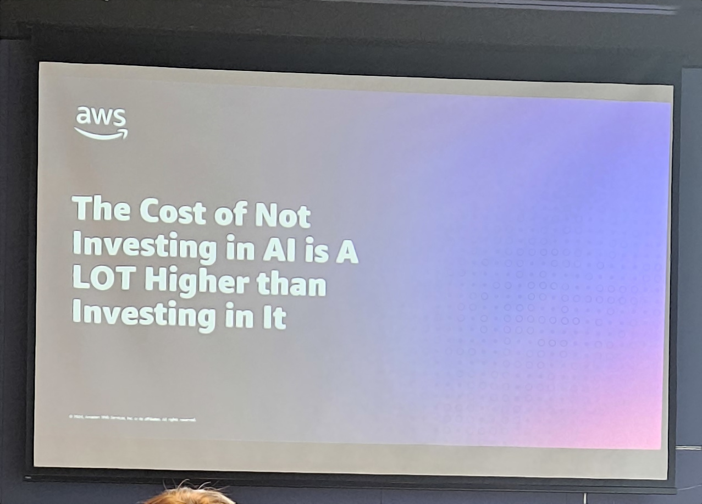

## Intro

This week I had the chance to attend **AWS Data & AI Day** in Warsaw.  
The event gathered over **200 data professionals, engineers, and business leaders** to explore how data and AI are shaping real-world business outcomes.  

The day featured two main tracks — **Business** and **Technology** — with sessions that covered a wide range of topics from architecture and data strategy to AI readiness and governance.  

### Key Themes

- Modern Data Architectures and Data Strategy  
- Modern Databases on AWS  
- Real-Time & Streaming Analytics  
- AI/ML Readiness and Data Foundations for AI  
- Data Governance, Security & Compliance  
- Case Studies from leading regional organizations (Snowflake, DocPlanner, Chaos Gears, Ringier Axel Springer Polska, Deloitte, and more)

## 9:00 Keynote Session

**Andrzej Horawa (AWS)** opened the event by noting that *87% of Polish businesses report increased revenue thanks to AI.*  
He emphasized that **security remains AWS's "priority zero"** and encouraged companies to approach AWS for hands-on support, stating:  
> "If you don't know what you want, come over to us."

**AWS Bedrock** was highlighted as part of the generative AI ecosystem, followed by **Deloitte's presentation** on AI transformation in the insurance sector.  
They showcased a **handwritten mail classification tool** and claimed that their approach outperforms ChatGPT in query accuracy, due to domain-specific tuning and better data handling.

## 11:30 AWS Presentation: Strands Agents SDK

The **Strands Agents SDK** introduces a more streamlined approach for building AI-driven agents.  
Key updates include:

- Native **OAuth support** with existing integrations.  
- Context handling improvements — no longer necessary to pass full context manually.  
- **AgentCore** supports both **short- and long-term memory**, syncing them automatically.  
- The **maximum session duration** is now 8 hours.  
- AgentCore has been **publicly available since two days before the event.**

## 12:30 Lunch Break

A pause to recharge and network before diving into the more technical afternoon sessions.

## 13:30 DocPlanner (AI/ML) "No Time to Whisper: GPU-Powered Doctor Visit Transcriptions"

DocPlanner shared insights into their AI-powered transcription project, designed for healthcare applications like **ZnanyLekarz**.  
Some key takeaways:

- **GPU resources in production are limited**, making optimization critical.  
- **Spot Instances** offer cost benefits but are unsuitable for long-running processes.  
- **Fine-tuning large models** is challenging, especially with **sensitive medical data**.  
- Proper **data preparation** is crucial for effective AI model training.  

The solution performs particularly well for **psychotherapists**, helping recommend medications based on transcribed sessions.  
This was one of the most practical and engaging sessions of the day.

## 14:45 Building the Modern Lakehouse with Apache Iceberg on AWS

This session focused on **Apache Iceberg** as the backbone for modern lakehouse architectures.  
Key highlights:

- Apache Iceberg simplifies **data management and governance**.  
- **Amazon Q** was noted as a useful companion for **code development and automation**.  
- Around **20% of consumer use cases** involve data migration between systems.  
- A compelling **energy sector case study** demonstrated tangible business value.

## 15:30 Snowflake: How AI Automates the Bidding Process for Leasing Contracts

Snowflake presented how AI automation drives efficiency in **leasing contract bidding**.  
Their client reportedly achieved a **5% increase in market share** through these solutions.  

Other highlights:

- Snowflake reinforced its position as **"the AI data cloud."**  
- Focus on **unstructured data** as "the future code."  
- Announced a **$2.5B collaboration agreement with AWS**.  
- Introduced **Snowflake Intelligence** — [ai.snowflake.com](https://ai.snowflake.com) — featuring **ChatGPT-like** tools adapted for enterprise contexts, integrated with internal systems like Active Directory, company docs, and Microsoft Teams.

## Conclusion

Overall, **AWS Data & AI Day Warsaw 2025** was a **well-organized and content-rich event**, with a strong balance of strategic vision and hands-on demonstrations.  

From agent frameworks and Data Lakehouses to healthcare AI and enterprise automation, the day showcased how **AWS and its partners are driving practical, impactful innovation** across industries.

