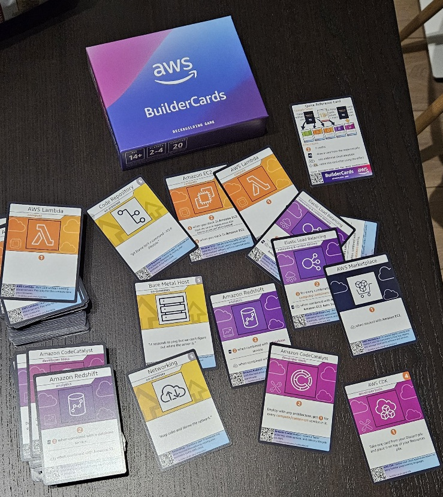
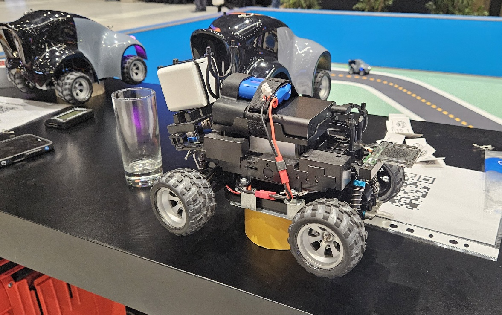

{toc.placeholder}

# My Experience at the AWS Summit in Katowice

This year, I was once again invited to an AWS event, this time held in Katowice. In this post, I'll share my experience
and highlights from the summit.

---

# In between sessions

## Venue

Compared to the event in Warsaw a year ago, I believe the venue and organization were significantly better.
The main exhibition hall was very spacious, with no "traffic" congestion. In contrast, at the Warsaw event,
the sponsor stands were spread across different floors, which sometimes led to crowded conditions.

The rooms where the sessions were held were also much more spacious.
This was particularly true for the Keynote Hall and Auditorium,
where everyone had a comfortable seat, and the speakers experienced
no technical issues (at least none that I noticed 😊).

## Exhibitions and Games

During the Summit, various AWS teams showcased engaging demos and exhibitions.

### Free Kick Challenge

The challenge was to score a goal with the fastest dribbling time and shot speed possible.

I tried my hand at it but would rather not share the details 😅.
Essentially, I performed much worse than the person in the GIF.
Out of three shots, one hit the post, and the others veered far from the goal 😊.

It was an exhilarating and well-organized game.
I even saw that someone on the leaderboard kicked the ball at a speed exceeding 90 km/h.

### Dream City

One team demonstrated a failsafe and load-balancing electricity mechanism for a small city.
The city was powered by various electricity sources, such as solar panels and wind turbines.
A volunteer could simulate a failure by, for example, placing dirt on a solar panel.
When this happened, less power was supplied to city lights or the amusement park,
but essential buildings, like the hospital, still received power.

Preparing everything and ensuring it worked seamlessly undoubtedly required significant effort.

### AWS BuilderCards

Everyone could join others to play the BuilderCards game.
This card game was well-prepared and highly educational.
By playing, you could learn about real relationships between AWS services.
It also included some humorous elements, and I highly recommend it 😺.

### DeepRacer

One exhibition presented the 4-wheeled rover which was able to recognize the track and keep the correct path
autonomously.

### Others

Many other exhibitions and games were available at sponsor stands,
including a Pinball game where you could win a LEGO Technic car set (I tried but had no luck).
There was even a lottery with a PlayStation as the grand prize.

## Food and beverages

I have to say that the catering service was brilliant.
Everyone could have a hot coffee, lemon juice or a piece of cake without a need to wait in a long queue.
Breakfast and lunch were also tasty and new food was delivered constantly.

---

# Sessions

The AWS Summit in Katowice was a whirlwind of insights, demos, and forward-thinking discussions about AI, cloud
infrastructure, and cybersecurity. Below is a detailed recap of the sessions I attended. Each session offered unique
perspectives on how AWS and its partners are shaping the future of technology.

## 9:00 Streamline RAG and Model Evaluation with Amazon Bedrock

The day kicked off with a session on **Amazon Bedrock**, a powerful tool for evaluating and selecting foundation models
for AI applications. The speaker emphasized the importance of evaluation to balance **quality, cost, and latency**
trade-offs when choosing models.

### Key Takeaways

- **Model Evaluation**: Amazon Bedrock simplifies the process of comparing and selecting the best foundation model using
  an input dataset in **JsonL** format.
- **Evaluation Methods**:
    - **Programmatic**: Automated evaluation for efficiency.
    - **Model as a Judge**: Uses another model to assess outputs.
    - **Human**: Manual review for nuanced feedback.
- Results are delivered in just a few clicks, with the **Amazon Bedrock Playground** providing an intuitive interface
  for testing.
- **RAG (Retrieval-Augmented Generation)**: Described as "LLM-powered search/answer generation," RAG leverages **vector
  databases** and allows users to bring their own datasets for tailored results.
- **Demo**: A live demo showcased how Bedrock evaluates multiple models, enabling easy comparison of results.

This session was a great primer on how Bedrock streamlines AI development, especially for teams looking to implement RAG
or optimize model selection.

---

## 10:15 From RAG to Agents: 18 Months of an Enterprise AI Journey

Presented by **Chaos Gears** (Karol Junde and Tomasz Dudek), this session chronicled an 18-month AI journey with their
customer, **Clariant**, highlighting the evolution of their systems.

### Journey Overview

- **Initial Setup**: Started with a simple architecture: **Amazon EC2 → API Gateway → Lambda → Bedrock**.
- **Evolution**: Transitioned to a more sophisticated setup with **API WebSocket Gateway → Lambda → Bedrock → AI
  Assistant**.
- **Human-in-the-Middle Approach**: Emphasized iterative collaboration between technology and organizational
  stakeholders.

### Challenges

- **RAG Limitations**: Natural language inputs can be deceptive, accepting "everything" but requiring careful
  validation.
- **Technical Debt**: Rapidly evolving frameworks like **LangGraph** create maintenance challenges.
- **Multi-Agent Systems**: Evaluating these systems is complex.
- **Hallucinations**: A persistent issue in LLM outputs.
- **Amazon OpenSearch**: Praised as an excellent vector storage solution for RAG.

### Key Insight

The presenters stressed that **enabling AI is not a one-time project**. Iterative development is critical for
fine-tuning both technology and organizational alignment.

This session was a reality check on the complexities of enterprise AI, tempered by practical advice on iterative
progress.

---

## 11:00 Keynote Session

The keynote, led by **Andrzej Horawa** (AWS Poland Country Leader), was a high-energy overview of AWS’s impact in Poland
and beyond. It highlighted the adoption of generative AI by **740,000+ Polish businesses**
and AWS’s **30 billion PLN investment** in the region.

### Highlights

- **Slavik Dimitrovich** (Director of AI/ML at AWS):
    - AWS’s infrastructure boasts **6 million+ km of fiber cabling** and **Outposts racks** for ultra-low latency.
    - A 14-year partnership with **NVIDIA** powers AWS’s AI capabilities.
    - **Graviton4**, a dedicated chip for Java applications, was showcased.
    - **Anthropic** leverages AWS **Trainium2 chips** for massive computing clusters.
- **Data and Analytics**:
    - Fully managed **Apache Iceberg tables** in **S3** were introduced, leveraging metadata for efficient data
      management.
    - **Amazon SageMaker Unified Studio** was presented as a centralized hub for AI development.
- **Customer Stories**:
    - **Radpoint** (Michał Smoliński): 43% of Polish radiologists use Radpoint, which powers Poland’s first cloud-native
      cancer screening program with **80,000+ participants**.
    - **Polish Aviation Group (PGL)** (Magdalena Niedzielska): PGL’s airline, LOT (operating since 1929), serves **10
      million passengers annually** using **AWS Fargate** for automatic infrastructure scaling.
- **AI Innovations**:
    - **Model Distillation**: Reduces model size with minimal accuracy loss.
    - **Amazon Q**: Enhances coding productivity and can be used to migrate **COBOL to Java**.

The keynote underscored AWS’s deep commitment to Poland and its leadership in AI and cloud infrastructure.

---

## 12:45 Future Forward: Cybersecurity and AI

Presented by **Palo Alto Networks**, this session explored how AI enhances cybersecurity, using a real-world example of
a **Disney** malware attack caused by a developer downloading malicious code from GitHub.

### Key Points

- **Precision AI**: Palo Alto’s AI-driven tools detect and mitigate attacks like the Disney incident.
- AI’s role in cybersecurity is growing, offering proactive threat detection and response.

This session highlighted the critical intersection of AI and cybersecurity, especially for organizations managing
complex cloud environments.

---

## 13:15 Exam Prep: AWS Certified AI Practitioner

Led by **Frank Spiess** (Senior Technical Trainer), this session prepared attendees for the **AWS Certified AI
Practitioner (AIF-C01)** exam.

### Notes

- **Exam Resources**: We reviewed a PDF with preparation materials.
- **New Question Type**: **Ordering** questions, requiring candidates to sequence steps correctly.
- **F1 Score**: A metric for evaluating model performance.
- **Kendra**: Extracts data from webpages.
- **Textract**: Performs OCR for document processing.

There was also a fun trivia segment that tested our AWS knowledge. There were 12 questions, which as mentioned should be
similar to an exam ones.

I finished at **11** place (out of about 30), so it went much better than my free kick shooting game 😄.

This session was practical and engaging, offering clear guidance for certification prep.

---

## 14:15 Securing Ryanair’s Skies: A Cloud Security Journey with Wiz

This **AWS Community** session detailed **Ryanair**’s cloud security strategy, serving its **190 million+ accounts**.
Presented with insights from [**Wiz**](https://www.wiz.io/) tool, the session emphasized proactive cloud
protection.

### Key Points

- **Threat Landscape**: Attackers target cloud environments, ignoring organizational structures.
- **Tech Stack**: Ryanair uses a **graph database** with **AWS Neptune** and follows the "principle of the fewest
  privileges."
- **Wiz**: Centralizes AWS services with an **agentless architecture** for streamlined security.

This session showcased how Ryanair balances scale and security in a high-stakes environment.

---

## 15:15 Logs Talk to Me! Using Amazon Bedrock to Chat About Logs

Presented by **Michal Salanci** (AWS Community), this session explored how to make **AWS CloudTrail** more
accessible using **Amazon Bedrock**.

### Workflow

- **User → Amazon Lex → Lambda → CloudTrail Lake → Bedrock (Claude 3.7)**.
- **Process**: Lambda generates queries, CloudTrail Lake retrieves results, and Bedrock delivers human-readable
  responses via Lex.
- **Amazon Lex**: Interprets user intent to facilitate natural language queries.

### Lessons Learned

- **Regional Limitation**: The model couldn’t be invoked in the **eu-central** region.
- **Prompt Quality**: Critical for effective results.
- **Cost**: Querying 2,000 logins triggers 2,000 Lex requests, driving up costs.
- **Alternatives**: Other services or foundational models might be better than Lex.

### Live Demo

The demo brought the concept to life, showing how logs can be queried conversationally.

This session was a practical look at making log analysis user-friendly, though it highlighted cost and regional
challenges.

---

## 16:15 Next-Generation Amazon SageMaker: The Center for Data, Analytics & AI

Presented by **Peter Rayner** (AWS Solutions Architect), this session positioned **Amazon SageMaker** as a unified
platform for data, analytics, and AI.

### Key Insights

- **Data Challenges**: 74% of businesses struggle to turn data into insights due to **data sprawl** and complex
  toolsets.
- **SageMaker JumpStart**: Enables one-click deployment of LLM models with custom data.
- **Live Demo**: Showcased SageMaker’s capabilities in action, highlighting its ease of use.

This session was a fitting end to the day, emphasizing SageMaker’s role in simplifying AI workflows.

---

# Final Thoughts

The AWS Summit in Katowice was a treasure trove of knowledge, blending technical deep dives with real-world
applications. From **Amazon Bedrock**’s streamlined RAG and model evaluation to **Ryanair**’s cloud security
innovations, the sessions showcased AWS’s leadership in AI, cloud, and cybersecurity. The iterative nature of AI
development, the power of tools like **SageMaker** and **Amazon Q**, and the growing role of AI in cybersecurity left me
inspired and eager to explore these technologies further.

Additionally, the Summit provided an excellent opportunity to connect with like-minded individuals, see cool exhibitions
and enjoy participating in engaging games organized by AWS and its sponsors.

One drawback coming to my mind was that I missed one session by Cloudflare because I was a minute late and
the room was already full. However, I understand that the interest could not be predicted.

If you’re considering attending a future AWS events, do it! The mix of hands-on demos, customer stories, and expert
insights is invaluable for anyone in the tech space.

--- 

*Note: This blog post is based on my personal notes and reflects my understanding of the sessions. For official details,
check AWS’s documentation or event resources.*