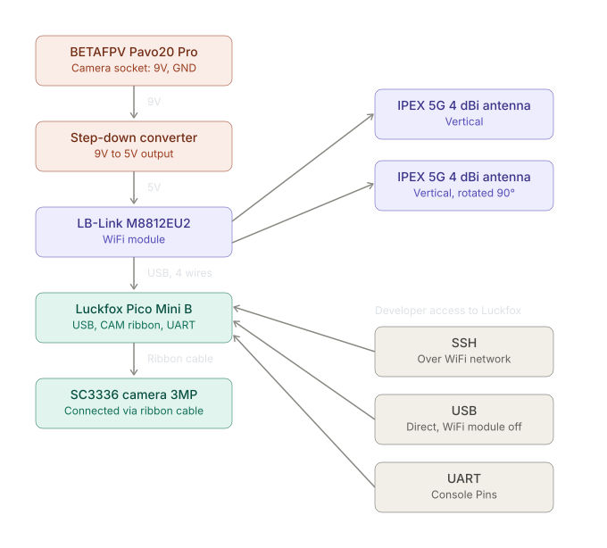

**POST_IN_PROGRESS**

{toc.placeholder}

# Introduction

Reasons for the creation of my very own IP camera:

* open source, so the software can be shared with others
* prevent connection to shady remote servers
* cheaper price
* browser based Web UI
* possibility to mount the camera as VTX for drone 

# Hardware

* Drone BETAFPV Pavo20 Pro ELRS 2.4G
* Luckfox Pico Mini B
* SC3336 Camera 3MP
* LB-Link M8812EU2 WiFi module
* 9V → 5V Step-down Converter
* 2 x IPEX 5G 4 dBi antenna

# Software

**[Repository](https://github.com/PrzemyslawSwiderski/cyber-eye)**

# Schematics



```text
drone = Drone BETAFPV Pavo20 Pro ELRS 2.4G
stepdown = 9V → 5V Step-down Converter
luckfox = Luckfox Pico Mini B
camera = SC3336 Camera 3MP
wifimod = LB-Link M8812EU2 WiFi module
antenna = IPEX 5G 4 dBi antenna

drone Camera socket GND -> stepdown IN-
drone Camera socket 9V V+ -> stepdown IN+
stepdown OUT+ -> wifimod VDD5.0 Power Supply
stepdown OUT- -> wifimod GND
wifimod USB connections (GND, VDD5.0, USB2.0+DP, USB2.0+DM) -> luckfox USB
luckfox CAM Ribbon cable -> camera input socket
wifimod 1. antenna socket -> 1. antenna vertical set
wifimod 2. antenna socket -> 2. antenna vertical set rotated 90 degrees 

Developer connects to Luckfox Pico Mini by:
 * SSH in WiFi network
 * directly by USB once WiFi module is disconnected
 * UART pins  
```

# Results

<video src="cyber-eye-result.mp4" class="markdown-img" controls>Cyber Eye Result Video</video>


# Conclusion

