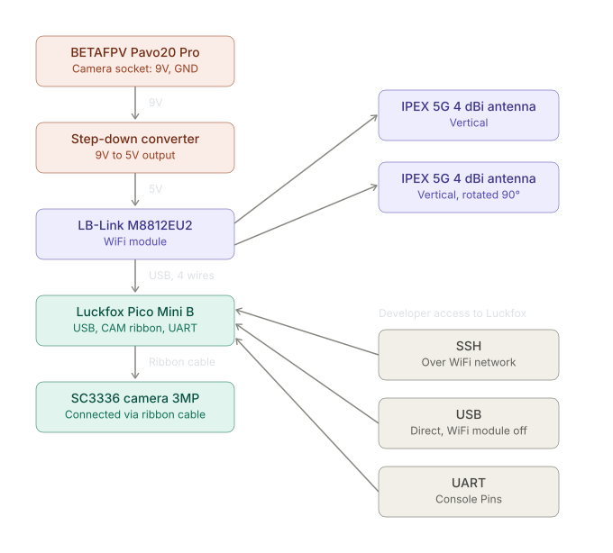

**POST_IN_PROGRESS**

{toc.placeholder}

# Introduction

Some time ago, I bought a Pavo20 Pro drone. To keep it simple and cost-effective, I chose the version without a VTX
(video transmission device). After flying it for a while, I decided to build my own budget-friendly VTX setup. The main
reasons for this project were:

* Existing commercial VTX kits are quite expensive, such as Walksnail ($305) or DJI ($360).
* Popular off-the-shelf solutions are closed-source, making them difficult to customize on the software side.
* I wanted to stream video directly to my smartphone via Wi-Fi, but I couldn't find any affordable kits that offered
  this feature.
* The receiving device needed to be versatile enough to double as a regular IP camera.

# Hardware

Initially, I tried building the project with an ESP32-P4. After running into poor Wi-Fi range from the built-in antenna,
I pivoted to a Luckfox board and an external LB-Link Wi-Fi module for better performance.

The final parts used for the camera only were:

* Linux based Luckfox Pico Mini B \$17
* SC3336 Camera 3MP \$10
* LB-Link M8812EU2 WiFi module \$20
* 9V → 5V Step-down Converter \$3
* 2 x IPEX 5G 4 dBi antenna \$6

Total cost: **\$56**

Additionally I used:

* Drone BETAFPV Pavo20 Pro ELRS 2.4G
* RadioMaster Pocket ELRS device to control the drone
* Xiaomi 17 to receive the video and basic telemetry signals

# Software

* **[Repository](https://github.com/PrzemyslawSwiderski/cyber-eye)**
* **[Custom Luckfox firmaware fork](https://github.com/PrzemyslawSwiderski/luckfox-pico)**


# Schematics



```text
drone = Drone BETAFPV Pavo20 Pro ELRS 2.4G
stepdown = 9V → 5V Step-down Converter
luckfox = Luckfox Pico Mini B
camera = SC3336 Camera 3MP
wifimod = LB-Link M8812EU2 WiFi module
antenna = IPEX 5G 4 dBi antenna

drone Camera socket GND -> stepdown IN-
drone Camera socket 9V V+ -> stepdown IN+
stepdown OUT+ -> wifimod VDD5.0 Power Supply
stepdown OUT- -> wifimod GND
wifimod USB connections (GND, VDD5.0, USB2.0+DP, USB2.0+DM) -> luckfox USB
luckfox CAM Ribbon cable -> camera input socket
wifimod 1. antenna socket -> 1. antenna vertical set
wifimod 2. antenna socket -> 2. antenna vertical set rotated 90 degrees 

Developer connects to Luckfox Pico Mini by:
 * SSH in WiFi network
 * directly by USB once WiFi module is disconnected
 * UART pins  
```

# Results

<video src="cyber-eye-result.mp4" class="markdown-img" controls>Cyber Eye Result Video</video>

# Conclusion

