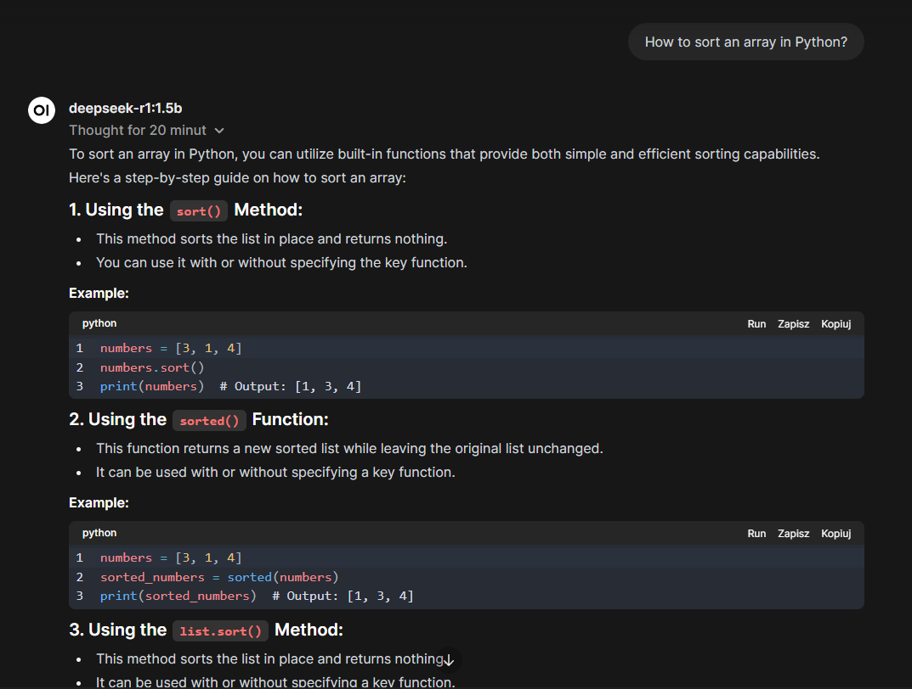

{toc.placeholder}

## Intro

The DeepSeek R1 LLM model was **[released](https://api-docs.deepseek.com/news/news250120)** this week.

It seems to be a revolutionary development step in AI.

In this post I will focus on its biggest advantage (IMHO 😊) ->
because it is open source, everyone can download it, use locally, offline and for free.

Some time ago I created a little home lab with a Tiny Dell OptiPlex 3050.
Below, I will describe how I started my own ChatGPT-like service 😉.

## Open WebUI, Ollama and CPU setup

To make the job easier I used pretty cool [Open WebUI](https://docs.openwebui.com/) project.
It is basically an application which lets the user install and use different LLMs.
Thanks to Docker images, anyone can run it locally pretty easily.

For my homelab I am using the Docker compose to manage services as a code.
Open WebUI's Docker compose setup is described
**[here](https://docs.openwebui.com/getting-started/quick-start/#example-docker-composeyml)**,
so what I initially did was adding the following service to my `compose.yaml`:

```yaml
(...)
open-web-ui:
  container_name: "open-web-ui"
  image: "ghcr.io/open-webui/open-webui:latest-ollama"
  ports:
    - "8099:8080"
  volumes:
    - "../ai_data/:/app/backend/data"
```

I skipped the GPU parameters for now and wanted to run it on CPU for the smoke test purpose.

After hitting `docker compose up -d` on server, Docker started to build image.
It took some time because it was about 3GB big.

Once the image was build and container started, I was able to enter the web app at `http://localhost:8099`
address in my browser.

What I had to do after entering the home page was:

1. Creating the web application admin user,
2. Downloading the smallest available DeepSeek R1 model (`deepseek-r1:1.5b` tag).
   It could be done in Admin settings ("Settings" -> "Advanced" -> "Models" -> "Manage Models" tab).
3. After the model was downloaded by [Ollama](https://ollama.com/library/deepseek-r1), it was ready to be used.

To perform some test query I asked a simple question as belows:



You can notice it took 20 min for the model to respond. Probably because I used the CPU only.

## GPU setup

IN_PROGRESS

[//]: # (Fortunately, my little Dell server uses integrated Intel GPU chip 😎.)

[//]: # ()
[//]: # (Too bad Ollama does not support Intel chips out of the box but there is some trick to do it)

[//]: # (which is described **[here]&#40;https://github.com/mattcurf/ollama-intel-gpu&#41;**.)

[//]: # ()
[//]: # (What I had to do was adding new `ollama-intel-gpu` service and additional `Dockerfile`.)

[//]: # ()
[//]: # (I was pretty surprised that during the Docker compose rebuild action, some Ubuntu layers were needed.)

[//]: # (Since I am using Fedora on my server, it had to download additional ~10GB of data and lasted about 30 minutes.)


## Conclusion

In about 2 hours I was able to start my private and limitless ChatGPT-like AI agent 😲.
Pretty impressive and quite scary considering current OpenAI and NVIDIA values.
