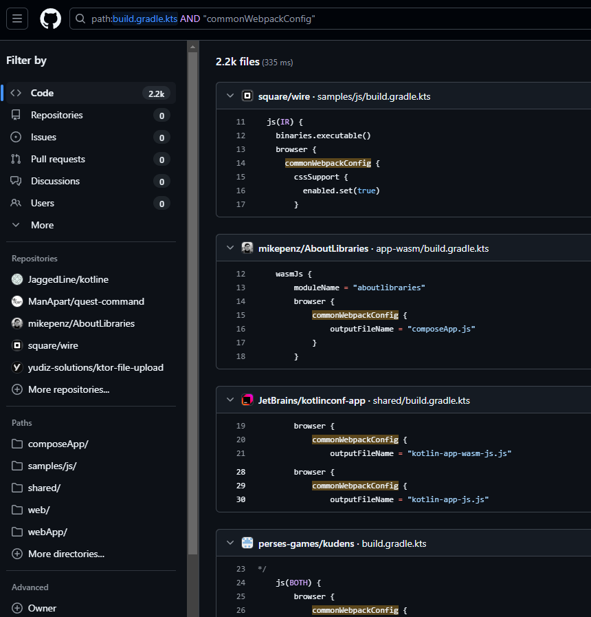

GitHub has this cool feature that lets the developer search the code by some criteria.

If we for example, type `path:build.gradle.kts AND "commonWebpackConfig"` into the search bar,
there will be sample usages in public repositories listed:

> Please note that only the default branches like `main` or `master` are indexed for the results.

Syntax supports other qualifiers like `language` as well.
Docs can be
found [**HERE**](https://docs.github.com/en/search-github/github-code-search/understanding-github-code-search-syntax).

It is pretty useful when we are learning new tools/frameworks and want to check how to use particular features or even
find some example projects 😊.
