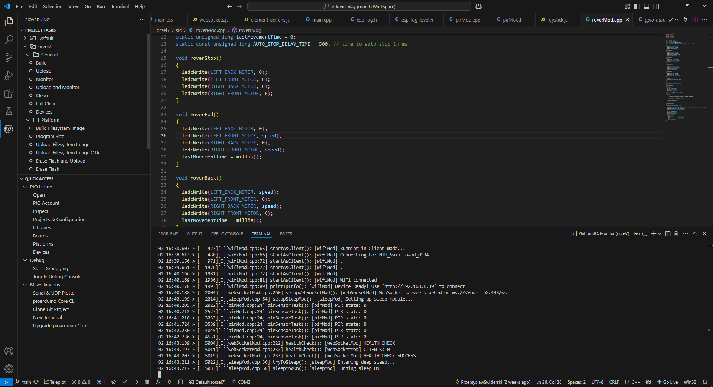

{toc.placeholder}

# Introduction

About a month ago, I decided to build my own patrolling robot.

Why?

* To remotely monitor my home and check what's happening when I'm away.
* To receive notifications if any movement is detected in my room.
* To maneuver the camera across different rooms to inspect for issues, such as leaks.
* To avoid off-the-shelf solutions and ensure my data remains private, bypassing potentially untrustworthy servers.
* To explore how AI can assist in this project.
* To refresh my knowledge of embedded systems and C++ programming. 😊

# Hardware

* ESP32-CAM
* L298N Motor Drive Module
* HC-SR501 PIR Sensor
* 3 x 18650 3.7V Li-ion Batteries
* Battery Case
* Power Switch
* Acrylic Platform
* 4 x Motors With Wheels
* Cables, Screws And Other Accessories

I bought parts from Allegro, Temu and [LAFVIN](https://lafvintech.com/) store.
They provide learning kits and other stuff.

Everything costed me 210PLN (~55$).

# Software

IN_PROGRESS

# Result

<video src="roaming_around.mp4" class="markdown-img" controls>Result Vid</video>

As you can see above the robot is working fine.
Responsiveness is pretty good and the user is able to steer it by using a web HTML page on desktop or Android. 😎
