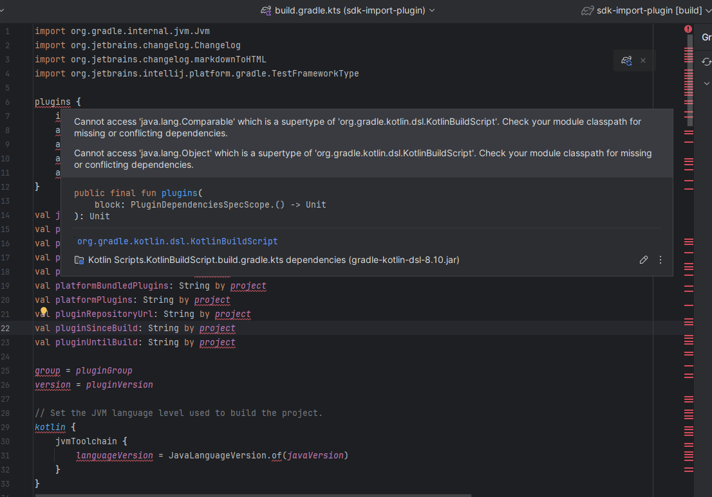

{toc.placeholder}

# Introduction

Some time ago I created
the [SDK-Import](https://plugins.jetbrains.com/plugin/24223-sdk-import/edit/versions/stable/600376) IntelliJ Plugin.
Unfortunately it depends on `PythonCore:231.8109.2` plugin which is not supporting the new `2024.2+` IntelliJ versions.
Because of that I had to update it to the latest one and the SDK-Import plugin itself.

The changes can be viewed in this [PR](https://github.com/PrzemyslawSwiderski/sdk-import-plugin/pull/45).

In this post I will try to describe how I did it.

# Updating to IntelliJ Platform Gradle Plugin

As noted
in [this](https://blog.jetbrains.com/platform/2024/07/intellij-platform-gradle-plugin-2-0/#the-importance-of-updating)
link, there are some breaking layout changes introduced in a new IntelliJ version.

In order to support new IntelliJ versions I had to migrate project build from the old `Gradle IntelliJ Plugin` to
`IntelliJ Platform Gradle Plugin`.
There is some [guide](https://plugins.jetbrains.com/docs/intellij/tools-intellij-platform-gradle-plugin-migration.html)
provided about how to do that.

Nevertheless, I faced some issues while doing it.

## Kover

After changing gradle plugin references in `build.gradle.kts` to `IntelliJ Platform Gradle Plugin` the tests started to
failing with the following message:

```text
Could not initialize property keys deprecation map because DeprecatedRuntimeConstants.__$hits$__ field isn't properly named
```

To fix it I had to follow the advice
from [here](https://github.com/JetBrains/intellij-platform-gradle-plugin/issues/1702) and
change `kover` settings block to following:

```kotlin
kover {
    currentProject {
        instrumentation {
            excludedClasses.add("org.apache.velocity.*")
        }
    }
}
```

## Junit 5 problem

As described
in [link](https://plugins.jetbrains.com/docs/intellij/tools-intellij-platform-gradle-plugin-faq.html#junit5-test-framework-refers-to-junit4)
when using `testFramework(TestFrameworkType.JUnit5)` the tests are failing because of `NoClassDefFoundError`.
I fixed it in my project by adding `testImplementation("org.junit.vintage:junit-vintage-engine:${libs.versions.junit}")`
to the dependencies section.

## Missing `runPluginVerifier` task

The new plugin uses `verifyPlugin` instead so I had to update `.github/workflows/build.yml` file to run the build
successfully.

## Gradle build file autocompletion

One issue I struggled to fix were so-called red lines in gradle build files (`build.gradle.kts`):



It seems like IDE could not resolve some Kotlin dependencies and autocompletion IntelliJ feature was not working because
of that.
Even though Gradle tasks are executed successfully it was pretty annoying that Intellij was complaining.

What finally resolved the issue 🤩 was removal of `.idea`, `build` and `.intellijPlatform`
directories and restarting the whole project.

## IntelliJ Platform Gradle Plugin update summary

Overall the migration went pretty smooth.
Migration [guide](https://plugins.jetbrains.com/docs/intellij/tools-intellij-platform-gradle-plugin-migration.html) was
pretty clear and I also used the updated [template](https://github.com/JetBrains/intellij-platform-plugin-template)
repository to check how the new reference files should look like.

Hopefully the temporary fixes I
mentioned ([Junit 5](/posts/sdk-import-plugin-update#junit-5), [Kover](/posts/sdk-import-plugin-update#kover)) will not
be necessary in the next plugin version and redundant code can be removed.

# Code changes

The source code of the plugin itself was not needed to be adjusted.
However, the testing framework had some breaking changes in the new `2024.2` version.

Necessary changes in test source code:

* changing `@RunInEdt` to `@RunInEdt(writeIntent = true)`
* replacing rules
    ```kotlin
    @JvmField
    @RegisterExtension
    val projectModel: ProjectModelExtension = ProjectModelExtension()
    private val project: Project
        get() = projectModel.project
    ```
  with fixtures helper functions
    ```kotlin
    private val projectModel = customProjectFixture()
    private val project: Project
        get() = projectModel.get()
    ```

After that the tests were compiling and green.

## Summary

Update went successfully.
The new `1.2.0` SDK-Import plugin was deployed and
is [ready](https://plugins.jetbrains.com/plugin/24223-sdk-import/) to be used in the new `2024.2`
IntelliJ releases 🙂.
