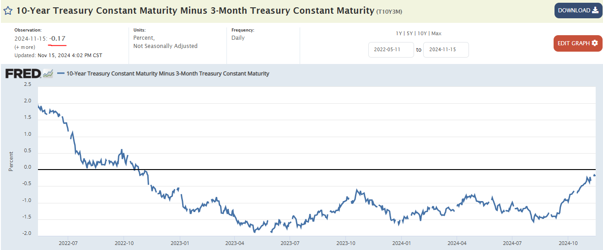

## Problem

As some of you may have heard, the yield curve inversion ended in
September [**REF**](https://www.usfunds.com/resource/the-yield-curve-inversion-just-ended-but-economic-risks-remain/).

With 783 consecutive days of inversion, it was the longest period since the issuance of 2-year notes.

Unfortunately, it is widely regarded as a strong recession indicator.

What is not always emphasized is the existence of another key measure -> `T10Y3M`.

Explanation:

* `T10Y2Y` which "uninverted" recently, reflects the difference between the "10-Year Treasury" and "2-Year Treasury"
  yields.
* `T10Y3M` measures the "10-Year Treasury Minus 3-Month Treasury Yield.". At the time of writing, it stands at `-0.17`
  and has not yet returned to positive territory.

[](https://fred.stlouisfed.org/series/T10Y3M)

## Question

Based on historical data, which yield curve is better at heralding the recession?

## Answer

To get the answer I decided to just ask ChatGPT 😊 with the following prompt:

```text
Could you please briefly tell which of T10Y2Y or T10Y3M yield curve uninversion is 
better at predicting the recession and why?
```

and the answer was:

```text
The T10Y3M yield curve uninversion (when it stops being inverted and returns to a normal positive slope) 
is generally better at predicting a recession compared to the T10Y2Y uninversion. 
Here's why:

1. Proximity to Recession:

* T10Y3M uninversion often occurs closer to the onset of a recession, making it a more immediate and reliable signal.
* T10Y2Y uninversion can occur further from a recession, and its timing is less consistent.

2. Economic Mechanism:

* The T10Y3M is more directly influenced by Federal Reserve policy and short-term economic conditions. 
  Its uninversion often reflects a pivot in monetary policy (e.g., rate cuts) due to growing economic weakness —> a direct precursor to recession.
* The T10Y2Y, while useful, is less sensitive to policy shifts and short-term dynamics, 
  making its uninversion a weaker recession predictor.

Summary:
The T10Y3M uninversion is a better predictor of recessions because it signals that 
short-term rates have fallen in response to deteriorating economic conditions, 
often marking the final lead-up to a downturn.
```

As seen above, "10-Year Treasury Minus 3-Month Treasury Yield" has been chosen to be a better indicator.

I also wanted to know some details:

```text
Once T10Y3M uninverts, what is the probability the recession and how much time is needed on average 
to see a major spike in the unemployment after the T10Y3M uninversion?
Can you please list historical examples?
Please give rather brief answer in a notepad format.
```

Answer:

```text
T10Y3M Uninversion and Recession/Unemployment Spike

**Probability of Recession**: 
- ~80% or higher after T10Y3M uninversion.

**Time to Major Unemployment Spike**: 
- Typically 6–18 months after uninversion.

**Historical Examples**:

1. **1980 Recession**
   - Uninversion: Early 1980
   - Recession Start: Q1 1980 (~3 months later)
   - Unemployment: Rose from ~6% to ~7.8% by mid-1980.

2. **1990 Recession**
   - Uninversion: Late 1988
   - Recession Start: Mid-1990 (~18 months later)
   - Unemployment: Rose from ~5.4% to ~6.8% by early 1991.

3. **2001 Dot-Com Recession**
   - Uninversion: Early 2000
   - Recession Start: March 2001 (~12 months later)
   - Unemployment: Rose from ~4% to ~6% by 2003.

4. **2008 Global Financial Crisis**
   - Uninversion: Mid-2007
   - Recession Start: December 2007 (~6 months later)
   - Unemployment: Rose from ~5% to ~10% by 2009.

5. **2020 COVID-19 Recession**
   - Uninversion: Late 2019
   - Recession Start: February 2020 (~3 months later)
   - Unemployment: Rose from ~3.5% to ~14.7% by April 2020.

**Summary**:
- High probability of recession after T10Y3M uninversion.
- Unemployment spike follows within 6–18 months on average.
```

I verified the unemployment with the Federal [**data**](https://fred.stlouisfed.org/series/UNRATE), and
it looks like ChatGPT provided the correct analysis because all numbers are matching.

## Conclusion

Based on the `T10Y3M` trend, it is likely it will return to positive in a month or two.

With the help of ChatGPT, I found that economic turmoil and a recession could become more probable.

In such a case, the unemployment rate could rise significantly, but let's hope that the FED will magically
implement "soft landing" and not cause the inflation to return 🙏.

Otherwise, it will be ordinary people who are impacted the most, and wealth inequality could widen even further.

## 19.12.2024 Update

On 13th of December, the `T10Y3M` uninverted to `0.06%`, indicating a heightened probability of a recession in 2025.
